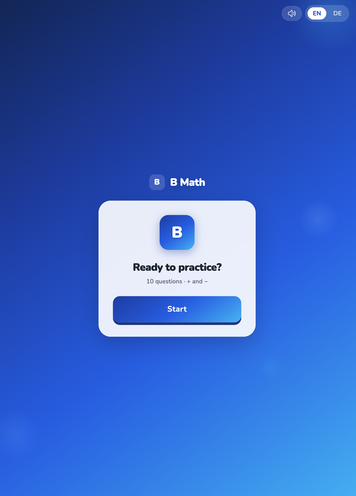
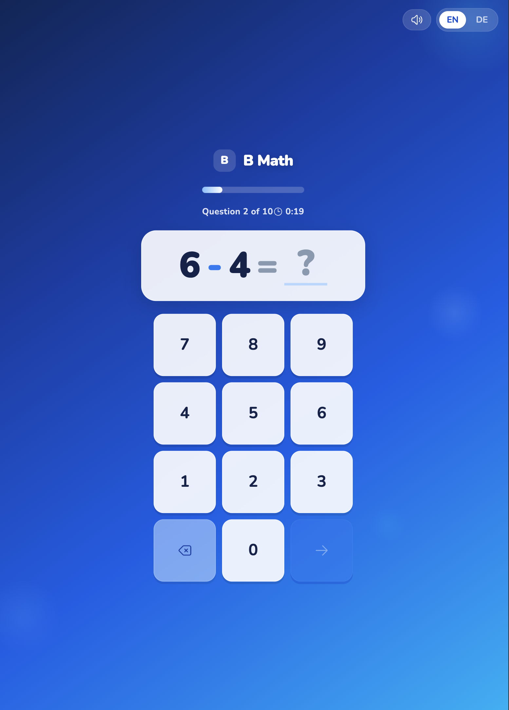
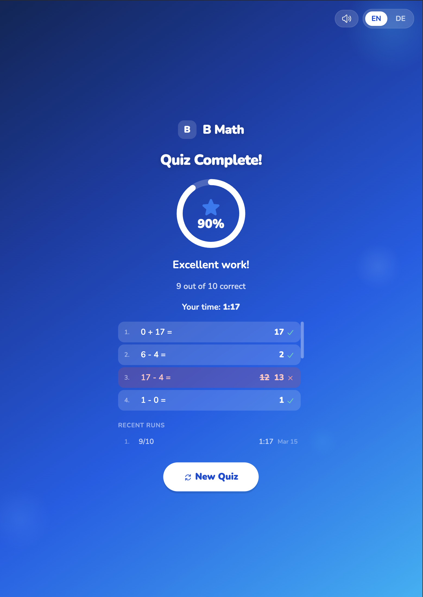

# B Math

A Vue 3 Progressive Web App (PWA) designed for first-grade primary school children to practice basic addition and subtraction (results 0–20). Kids answer 10 quick-fire questions per round and try to beat their personal best time with a perfect score.

**[Live Demo](https://petritr.github.io/b-math-practice/)**

## Screenshots

<!-- Replace these placeholders once you add images to docs/ -->
<p align="center">
  
  
  
</p>

## Features

- Addition and subtraction with answers in the 0–20 range
- Touch-friendly number pad built for small hands
- Instant correct/wrong feedback after each answer
- Score ring, medals, and time tracking to keep kids motivated
- Top 10 personal best scores saved locally
- Install as an app on any device (PWA)
- English and German language support
- Sound effects and spoken question narration

## Tech Stack

- Vue 3 + TypeScript + Vite
- Tailwind CSS v3
- Workbox-powered PWA (offline-ready)
- Web Audio API + Web Speech API

## Getting Started

```sh
npm install
```

### Development

```sh
npm run dev
```

### Production Build

```sh
npm run build
```

### Lint & Format

```sh
npm run lint
npm run format
```

## License

MIT
